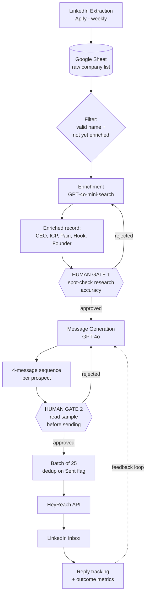

# Architecture & Design

This is not "send AI messages fast." It's a workflow with explicit **inputs, outputs, failure points, and human-review gates**. The automation does the heavy lifting; the controls decide what's allowed to reach a real person.

## System Diagram

## Inputs

| Input | Source | Notes |
|-------|--------|-------|
| Company list | Apify extraction or manual | Only `Organization_name` is required to start |
| ICP / positioning config | `CONFIGS/` | Who you sell to, how you position — drives both prompts |
| Industry parameters | `CONFIGS/` | Which fields to research (funding for SaaS, FDA status for health, etc.) |

## Outputs

| Output | Where | Used by |
|--------|-------|---------|
| Enriched prospect record | Google Sheet | Human reviewer, message generator |
| 4-message sequence | Google Sheet | Reviewer, HeyReach |
| Send + outcome tracking | Google Sheet | Metrics, feedback loop |

## Failure Points & Guardrails

The interesting part of any outreach system is **where it breaks** and what stops the break from reaching a person.

| # | Failure mode | What goes wrong | Guardrail |
|---|--------------|-----------------|-----------|
| 1 | **Enrichment hallucination** | Model invents a funding round, wrong CEO, fake metric | Prompt forbids fabricating named facts (person/date/$); inference must be hedged; Gate 1 spot-check |
| 2 | **Wrong-person match** | `CEO_LinkedIn` points to a same-name stranger | URL format validation; Gate 1 verifies name ↔ company |
| 3 | **Templated output** | Model defaults to the same opening line across founders | Variation instructions, banned-pattern list, em-dash ban; Gate 2 reads a sample |
| 4 | **ICP misread** | Research misidentifies who they sell to → irrelevant pitch | ICP is the highest-weighted field; reviewed at Gate 1 |
| 5 | **Stale data** | Funding/role changed since extraction | Weekly re-extraction; every record is dated |
| 6 | **Over-send / spam** | Aggressive batching, duplicate sends | Batches of 25; `Sent_to_HeyReach` dedup flag; respect platform limits |

## Where Humans Stay in the Loop

Two gates, both surfaced in the **Google Sheet** so a non-technical reviewer (e.g. the person who owns the relationship) can approve without touching n8n:

- **Gate 1 — after enrichment, before spending tokens on messages.** Catch bad research early. Cheap to reject here.
- **Gate 2 — after generation, before anything is sent.** The sheet *is* the approval queue. Nothing reaches a real inbox unreviewed.

This is the difference between "automation" and "AI-assisted." The machine drafts; a person decides.

## Metrics I Track (and Why)

Volume is the vanity metric. These are the ones that tell you the system is *working well*, not just *working fast*:

| Metric | What it measures | Why it matters |
|--------|------------------|----------------|
| **Personalization accuracy** | % of sampled messages referencing a *verifiably correct, specific* detail | The whole thesis is "real research beats templates" — this proves or kills it |
| **Enrichment accuracy** | % of sampled records with correct CEO + ICP | Garbage in → confidently wrong outreach |
| **False-positive outreach rate** | % sent to wrong-fit or wrong-person | The reputational risk metric. Optimize this *down*, not sends up |
| **Connection acceptance rate** | % of requests accepted | First signal the opener lands |
| **Positive-reply rate** | % of replies that are genuinely interested | Separates "got a reply" from "got a *good* reply" |
| **Review time per batch** | Minutes a human spends per 25 | Tells you if the guardrails are sustainable or a bottleneck |

Most are **sampled audits**, not dashboard counters — you read 10 messages and score them. That's deliberate: quality is judged, not just counted.

## What I'd Improve Next

- **Automated enrichment validation** — cross-check `CEO_LinkedIn` against the company domain and flag low-confidence records before they hit Gate 1, so humans only review the uncertain ones.
- **A pre-generation fit score** — rank prospects by ICP fit *before* spending GPT-4o tokens on messages; skip the bottom of the list.
- **Reply classification** — auto-bucket responses (interested / not now / not a fit) to close the feedback loop without manual sorting.
- **Opening-line A/B testing** — systematically test connection-request angles instead of trusting one prompt.
- **Pattern feedback** — feed the openings that earned positive replies back into the copywriter prompt, so the system improves with use.

These are the difference between a project that's *done* and a system that *gets better* — which is the more honest place to leave it.
