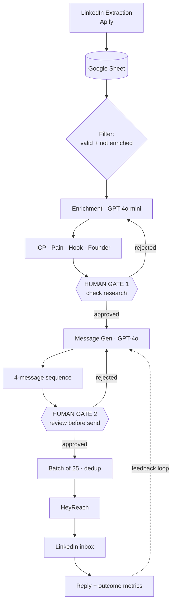

# AI-Assisted Outreach Workflow (with Guardrails)

An open-source, industry-agnostic outreach system that researches prospects, drafts personalized LinkedIn sequences, and sends at scale — **with explicit human-review gates and quality controls**, so automation doesn't become spam-at-scale.

Built with n8n, GPT-4, Apify, and HeyReach. **Current example:** B2B SaaS founder outreach.

> The automation is the easy part. The system is the controls. This repo is as much about *where a human stays in the loop* and *what the model is not allowed to do* as it is about the AI.

## System at a Glance



**Full design — inputs, outputs, every failure mode mapped to its guardrail, and the metrics I track — is in [ARCHITECTURE.md](ARCHITECTURE.md).**

## What Makes This a System, Not a Demo

- **Two human-review gates**, placed by cost: a cheap rejection point *before* the expensive model runs, and a final approval *before* anything reaches an inbox. Both surfaced in the Google Sheet so a non-technical reviewer can approve without touching n8n.
- **Guardrails against the model's bad habits** — no fabricated facts (person/date/$ it can't support), no em dashes, a banned-pattern list so every message doesn't collapse into the same opener.
- **Quality-first metrics** — the headline number is **false-positive outreach rate** (wrong person / wrong fit), optimized *down*. Volume is a vanity metric.
- **Industry-agnostic** — swap the config and prompts; the control structure stays.

## What It Does

1. **Extracts leads** from LinkedIn via Apify (weekly, customizable criteria)
2. **Enriches prospects** with AI research — funding, ICP, pain point, founder detail
3. **Generates a 4-message sequence** grounded in the research, not a template
4. **Routes through two human gates** before anything sends
5. **Sends via HeyReach** in batches of 25, deduplicated
6. **Tracks outcomes** for the quality metrics and feedback loop

## Quick Start

```
1. Clone this repo
2. Import FLOWS/*.json into n8n
3. Follow SETUP.md (credentials + replace placeholders)
4. Pick CONFIGS/b2b-saas-config.json or adapt for your industry
5. Test on 10 prospects through both gates before scaling
```

Full walkthrough: [EXAMPLES/b2b-saas-example.md](EXAMPLES/b2b-saas-example.md).

## Project Structure

```
ai-sdr-outreach-flow/
├── ARCHITECTURE.md         # System design, failure points, guardrails, metrics
├── FLOWS/                  # Two n8n workflows (enricher + outreach)
├── CONFIGS/                # Industry templates (B2B SaaS, Enterprise, D2C...)
├── PROMPTS/                # Enricher + copywriter prompts (customizable)
├── INTEGRATIONS/           # Apify, HeyReach, Google Sheets setup
├── EXAMPLES/               # B2B SaaS end-to-end walkthrough
├── MEDIUM_ARTICLE.md       # Long-form write-up
├── LINKEDIN_POST.md        # Short-form post drafts
└── SETUP.md                # Step-by-step installation
```

## Metrics I Track (and Why)

| Metric | Why it matters |
|--------|----------------|
| **Personalization accuracy** | Proves the "research beats templates" thesis — or kills it |
| **Enrichment accuracy** | Garbage in → confidently wrong outreach |
| **False-positive outreach rate** | The reputational-risk metric. Driven *down*, not sends up |
| **Connection acceptance / positive-reply rate** | Outcome signal — but secondary to quality |
| **Review time per batch** | Tells you if the guardrails are sustainable |

Most are **sampled audits**, not counters — quality is judged, not just counted. Details in [ARCHITECTURE.md](ARCHITECTURE.md).

## What I'd Improve Next

- Automated enrichment validation (cross-check CEO LinkedIn ↔ company domain; flag low-confidence so humans review only the uncertain records)
- A pre-generation fit score to skip low-ICP-fit prospects before spending GPT-4o tokens
- Reply classification to close the feedback loop automatically
- Opening-line A/B testing + feeding winning patterns back into the prompt

The honest place to leave a project is "gets better," not "done."

## Cost

| Tool | Cost | Purpose |
|------|------|---------|
| n8n | $0–50 | Orchestration (self-hosted = $0) |
| OpenAI API | $20–40 | Research + generation |
| Apify | $0–5 | Lead extraction |
| HeyReach | $25 | LinkedIn sending |
| **Total** | **$45–120/mo** | for 500–1000 prospects |

## Contributing

Industry config to share? See [CONTRIBUTING.md](CONTRIBUTING.md). License: MIT.

---

If you're building in this space, I'd rather compare notes on **controls and quality measurement** than send volume. That's where the interesting problems are.
